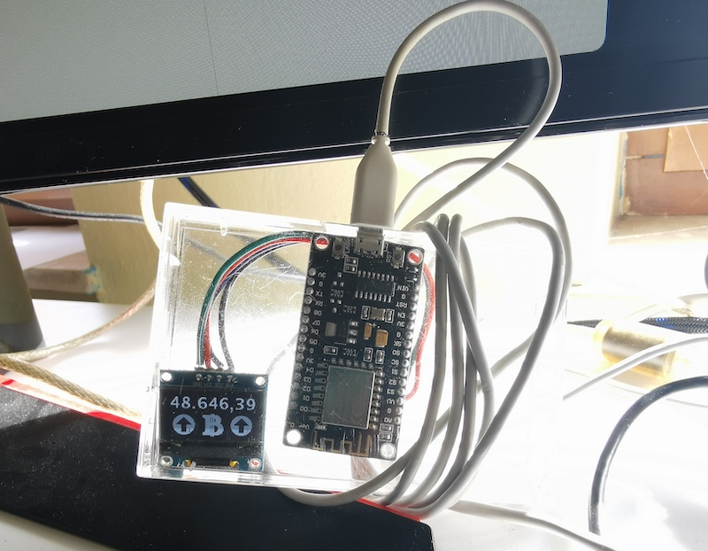
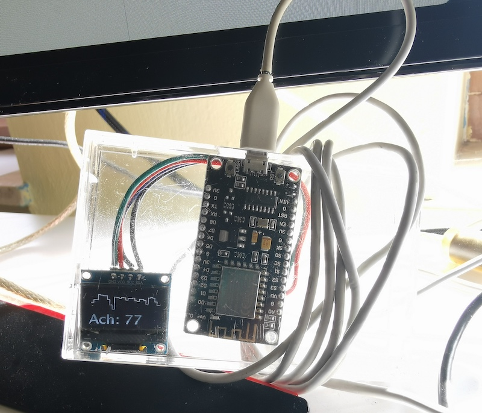

# Yet another wifi display

A friend (I'm looking at you, [derphilipp](https://github.com/derphilipp)!) "forced" me to ut this up here. I built a little wifi-connected display to show the current Bitcoin value (alongside a 1-day and a 7-day trend comparision) as well as the current ranking of my podcast at Apple Podcasts. It's based on the NodeMCU (the WiFi version, obviously) and an Adafruit mini OLED display with 128x64 pixel screen size. I'm planning on displaying Covid-19-related information in my area as well.

Basically, it reads JSON files from a webserver in my home network (with little changes, fetching information from https-secured internet services should be no problem as well). It might seem as a detour but has three significant benefits:
- I can easily gather and provide historical information
- I can perfom calculations (average, sums, ...) in PHP with which I am way more comfortable as with C
- I can dramatically reduce JSON file sizes (you should always check your JSON file sizes and initialize the ```DynamicJsonDocument``` with the correct size – this [tool](https://arduinojson.org/v6/assistant/) shold be helpful determining the right size)

## For now, it looks like this
### Screen 1


### Screen 2


### Screens 3-5 (sorry, no image)
I displays the Covid-related numbers from the German RKI ("Inzidenzahlen") for the nearby cities and regions.

## Components


Here's the full code:
```C++
#include <Arduino.h>
#include <U8g2lib.h>
#ifdef U8X8_HAVE_HW_SPI
  #include <SPI.h>
#endif
#ifdef U8X8_HAVE_HW_I2C
  #include <Wire.h>
#endif
#ifdef __AVR__
  #include <avr/power.h>
#endif
#include <ESP8266WiFi.h>
// #include <WiFiClientSecureBearSSL.h>
#include <ESP8266HTTPClient.h>
#include <DNSServer.h>            
#include <ESP8266WebServer.h>     
#include <WiFiManager.h>
#include <ArduinoJson.h>

WiFiManager wifiManager;
#define SDApin 4;
#define SCLpin 5;
U8G2_SH1106_128X64_NONAME_F_HW_I2C u8g2(U8G2_R0, /* reset=*/ U8X8_PIN_NONE);
HTTPClient http;
String upArrow = "\x4c";
String downArrow = "\x49";
int screentime = 12 * 1000;

// main loop
void loop(void) {
  DynamicJsonDocument coronaInzidenz = fetchJson("http://192.168.x.y/covid.json", 2336);
  for (int i = 1; i < 6; i++) {
    u8g2.clearDisplay();
    u8g2.clearBuffer();
    if (i == 1) { page1(); }
    if (i == 2) { page2(); }
    if (i == 3) { page3(coronaInzidenz, "Ansbach"); }
    if (i == 4) { page3(coronaInzidenz, "Fuerth"); }
    if (i == 5) { page3(coronaInzidenz, "Nuernberg"); i = 0; }
    u8g2.sendBuffer();
    delay(screentime);
  } 
}

// function to make http request
        // {
            // https is possible but in my case not necessary:
              // std::unique_ptr<BearSSL::WiFiClientSecure>client(new BearSSL::WiFiClientSecure);
              // client->setInsecure();
              // HTTPClient https;
              // if (https.begin(*client, target_url + statusMode)) {  // ...
        // }
String fetchHttp(String url) {
  String content = "";
  if (http.begin(url)) {
    int httpCode = http.GET();
    if (httpCode > 0) {
      if (httpCode == HTTP_CODE_OK || httpCode == HTTP_CODE_MOVED_PERMANENTLY) {
        content = http.getString();
      } else { // http request not 200
        Serial.printf("[GET] Request... failed, error: %s\n", http.errorToString(httpCode).c_str());
        content = "{}";
      }
    } else { // http status code is 0
      Serial.println("[GET] Request... failed, HTTP returned zero");
      content = "{}";
    }
    http.end();
  } else { // http.begin() failed
    Serial.printf("[HTTPS.begin] Unable to connect\n");
    content = "{}";
  }
  return content;
}

// function to fetch json
DynamicJsonDocument fetchJson(String url, int docSize) {
  DynamicJsonDocument doc(docSize);
  deserializeJson(doc, fetchHttp(url));
  return doc;
}

// bitcoin screen
void page1() {
    // check how big your JSON doc ist here: https://arduinojson.org/v6/assistant/
    DynamicJsonDocument doc = fetchJson("http://192.168.x.y/btc.json", 500); // I have my own "API" because I use this for different things, but you could make this work with an public API like this as well: https://www.bitcoin.de/de/api/marketplace
    
    Serial.println("current BTC: " + doc["current"].as<String>());
    Serial.println("compared to average (1day): " + doc["compared"]["1day"].as<String>());
    Serial.println("compared to average (7day): " + doc["compared"]["7day"].as<String>());

    u8g2.setDrawColor(1);
    
    // write bitcoin chart value
    u8g2.setFont(u8g2_font_luRS18_tf); // u8g2_font_crox4hb_tr);
    u8g2.setCursor(0, 20);
    u8g2.print(doc["current"].as<String>());

    // Show the arrow for the 1-day trend
    u8g2.setFont(u8g2_font_open_iconic_all_4x_t);
    u8g2.setCursor(5, 62);
    if (doc["compared"]["1day"].as<String>() == "+") {
      u8g2.print(upArrow);
    } else {
      u8g2.print(downArrow);
    }

    // Show the arrow for the 7-day trend
    u8g2.setFont(u8g2_font_open_iconic_all_4x_t);
    u8g2.setCursor(91, 62);
    if (doc["compared"]["7day"].as<String>() == "+") {
      u8g2.print(upArrow);
    } else {
      u8g2.print(downArrow);
    }

    // draw a pseudo bitcoin logo
    u8g2.setCursor(48, 62);
    u8g2.print("\x5f"); 
    u8g2.drawLine(62,28,62,64);
    u8g2.drawLine(63,28,63,64);
    u8g2.drawLine(65,28,65,64);
    u8g2.drawLine(66,28,66,64);

    // draw a little 1 and 7 into the arrows to make it more readable
    u8g2.setDrawColor(0);
    u8g2.setFont(u8g2_font_5x8_tn);
    u8g2.setCursor(27, 58);
    u8g2.print("1");
    u8g2.setCursor(114, 58);
    u8g2.print("7");
    u8g2.setDrawColor(1);
}

// podcast chart screen
void page2() {
  DynamicJsonDocument doc = fetchJson("http://192.168.x.y/podcast.json", 1536); // I have my own "API" because I use this for different things, but you could make this work with an public API like this as well: http://itunes.apple.com/de/rss/toppodcasts/genre=1487/limit=100/json
  
  int last_x = 4;
  int last_y = -1;
  for (int i = 0; i < 30; i++) {
    int x = last_x;
    int x_x = last_x + 4; 
    float place = doc["data_unsorted"][i].as<float>();
    int y = floor(place/200.0*64);
    if (last_y == -1) { last_y = y; }
    u8g2.drawLine(last_x,last_y,x,y);
    u8g2.drawLine(x,y,x_x,y);
    last_x = x_x;
    last_y = y;
  }

  u8g2.setFont(u8g2_font_luRS18_tf); // u8g2_font_crox4hb_tr);
  u8g2.setCursor(0, 62);
  u8g2.print("Ach: " + doc["data_unsorted"][29].as<String>());
  Serial.println("Ach: " + doc["data_unsorted"][29].as<String>());
}

// placeholders ... for now
void page3(DynamicJsonDocument doc, String city) {
  // Ansbach
  u8g2.setFont(u8g2_font_crox4hb_tr);
  u8g2.setCursor(2, 15);
  u8g2.print(city);

  u8g2.setFont(u8g2_font_pxplusibmvga8_mf);
  u8g2.setCursor(2, 28);
  u8g2.print("Land:");
  u8g2.setCursor(66, 28);
  u8g2.print("Stadt:");
  
  u8g2.setFont(u8g2_font_logisoso28_tf); // u8g2_font_luRS18_tf); // u8g2_font_crox4hb_tr);
    
  String an = String(int(round(doc["current"]["current"]["LK " + city].as<float>())));
  u8g2.setCursor(2, 62);
  u8g2.print(an);
  delay(20);
  Serial.println(city + ": " + an);
  an = String(int(round(doc["current"]["current"]["SK " + city].as<float>())));
  Serial.println(city + " (Stadt): " + an);
  u8g2.setCursor(66, 62);
  u8g2.print(an); 
  u8g2.drawLine(62, 20, 62, 64);
  delay(20);
}

void setup() {
  Serial.begin(9600); 
  delay(100);
  u8g2.begin();
  u8g2.setFont(u8g2_font_7x13B_mf);
  u8g2.setCursor(0, 20);
  u8g2.print("Setting up ...");
  delay(200);
  u8g2.setCursor(0, 40);
  u8g2.print("Chip: " + String(ESP.getChipId()));
  u8g2.sendBuffer();
  
  #if defined(__AVR_ATtiny85__) && (F_CPU == 16000000)  // Not really sure if this is needed ...
    clock_prescale_set(clock_div_1);
  #endif
  
  //WiFi.disconnect();   // Uncomment to delete old/saved WiFi credentials 
  u8g2.setCursor(0, 60);
  u8g2.print("Wifi connect");
  delay(500);
  u8g2.sendBuffer();
  Serial.print("\nTrying to connect to WiFi ...\n");
  delay(50);
  wifiManager.autoConnect(("setup-display-" + String(ESP.getChipId())).c_str()); // Tries to connect to a known wifi – 
                                                                                  // if this failed, it opens up an access point under 192.168.4.1
  u8g2.setCursor(0, 60);
  u8g2.print("Wifi successful");
  u8g2.sendBuffer();
  
  http.useHTTP10(true);
}
```

## Data

In case you are wondering – my self-built JSON API (I guess it's a bit much to call it an API, but I'll do it anyway!) produces data like this:

**Bitcoin**
```json
{"data":{"rawdata":["39539.65"],"1daydata":[],"7daydata":[]},"reversed":{"rawdata":["49285.99"]},"average":{"1day":"48.847,05","7day":"48.259,06","all":"43.690,66"},"compared":{"1day":"+","7day":"+","all":"+"},"current":"49.285,99"}
```

**Podcast**
```json
{"data":{"17.02.2021":"50","18.02.2021":"50","19.02.2021":"21","20.02.2021":"23","21.02.2021":"28","22.02.2021":"27","23.02.2021":"47","24.02.2021":"81","25.02.2021":"105","26.02.2021":"34","27.02.2021":"37","28.02.2021":"40","01.03.2021":"32","02.03.2021":"37","03.03.2021":"49","04.03.2021":"39","05.03.2021":"39","06.03.2021":"36","07.03.2021":"51","08.03.2021":"55","09.03.2021":"41","10.03.2021":"43","11.03.2021":"48","12.03.2021":"69","13.03.2021":"34","14.03.2021":"29","15.03.2021":"32","16.03.2021":"56","17.03.2021":"77","18.03.2021":"112"},"data_unsorted":["50","50","21","23","28","27","47","81","105","34","37","40","32","37","49","39","39","36","51","55","41","43","48","69","34","29","32","56","77","112"]}
```

**Covid**
```json
{"data":{"rawdata":{"LK Ansbach":["89.3868065073595"],"SK Ansbach":["90.9134408344897"],"LK Fuerth":["120.489083858705"],"SK Fuerth":["150.198059098656"],"LK Nuernberg":[0],"SK Nuernberg":["134.267029341976"]},"datedata":{"LK Ansbach":{"17.03.2021":"89.3868065073595","18.03.2021":"96.4294033836969","19.03.2021":"95.3459269411835"},"SK Ansbach":{"17.03.2021":"90.9134408344897","18.03.2021":"62.2039332025456","19.03.2021":"62.2039332025456"},"LK Fuerth":{"17.03.2021":"120.489083858705","19.03.2021":"106.064334382663"},"SK Fuerth":{"17.03.2021":"150.198059098656","18.03.2021":"146.30691767123","19.03.2021":"134.633493388951"},"LK Nuernberg":{"19.03.2021":0},"SK Nuernberg":{"17.03.2021":"134.267029341976","18.03.2021":"127.515095395181","19.03.2021":"147.192160040126"}},"1daydata":{"LK Ansbach":[],"SK Ansbach":[],"LK Fuerth":[],"SK Fuerth":[],"LK Nuernberg":[],"SK Nuernberg":[]},"7daydata":{"LK Ansbach":[],"SK Ansbach":[],"LK Fuerth":[],"SK Fuerth":[],"LK Nuernberg":[],"SK Nuernberg":[]}},"reversed":{"rawdata":{"LK Ansbach":["95.3459269411835"],"SK Ansbach":["62.2039332025456"],"LK Fuerth":["106.064334382663"],"SK Fuerth":["134.633493388951"],"LK Nuernberg":[0],"SK Nuernberg":["147.192160040126"]}},"average":{"1day":{"LK Ansbach":93.72071227741328,"SK Ansbach":71.7737690798603,"LK Fuerth":113.276709120684,"SK Fuerth":143.71282338627898,"LK Nuernberg":0,"SK Nuernberg":136.32476159242768},"7day":{"LK Ansbach":93.72071227741328,"SK Ansbach":71.7737690798603,"LK Fuerth":113.276709120684,"SK Fuerth":143.71282338627898,"LK Nuernberg":0,"SK Nuernberg":136.32476159242768},"all":{"LK Ansbach":93.72071227741328,"SK Ansbach":71.7737690798603,"LK Fuerth":113.276709120684,"SK Fuerth":143.71282338627898,"LK Nuernberg":0,"SK Nuernberg":136.32476159242768}},"compared":{"1day":{"LK Ansbach":"+","SK Ansbach":"-","LK Fuerth":"-","SK Fuerth":"-","LK Nuernberg":"-","SK Nuernberg":"+"},"7day":{"LK Ansbach":"+","SK Ansbach":"-","LK Fuerth":"-","SK Fuerth":"-","LK Nuernberg":"-","SK Nuernberg":"+"},"all":{"LK Ansbach":"+","SK Ansbach":"-","LK Fuerth":"-","SK Fuerth":"-","LK Nuernberg":"-","SK Nuernberg":"+"}},"current":{"current":{"LK Ansbach":"95.3459269411835","SK Ansbach":"62.2039332025456","LK Fuerth":"106.064334382663","SK Fuerth":"134.633493388951","LK Nuernberg":0,"SK Nuernberg":"147.192160040126"}}}
```

Have fun rebuilding or improving this – and don't forget to [let me know about it](https://twitter.com/MirUnauffaellig)!

## Licensing info

This project with all its contents is under CC BY NC 4.0 license. Learn more about what you may and what you may not do here: ([German](https://creativecommons.org/licenses/by-nc/4.0/deed.de) | [English](https://creativecommons.org/licenses/by-nc/4.0/deed.en))
