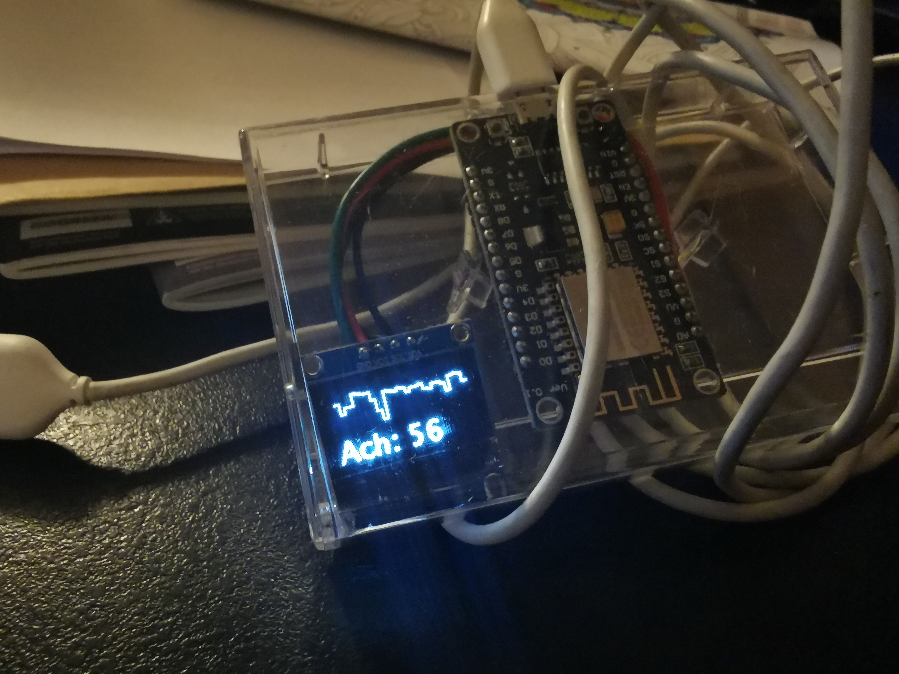
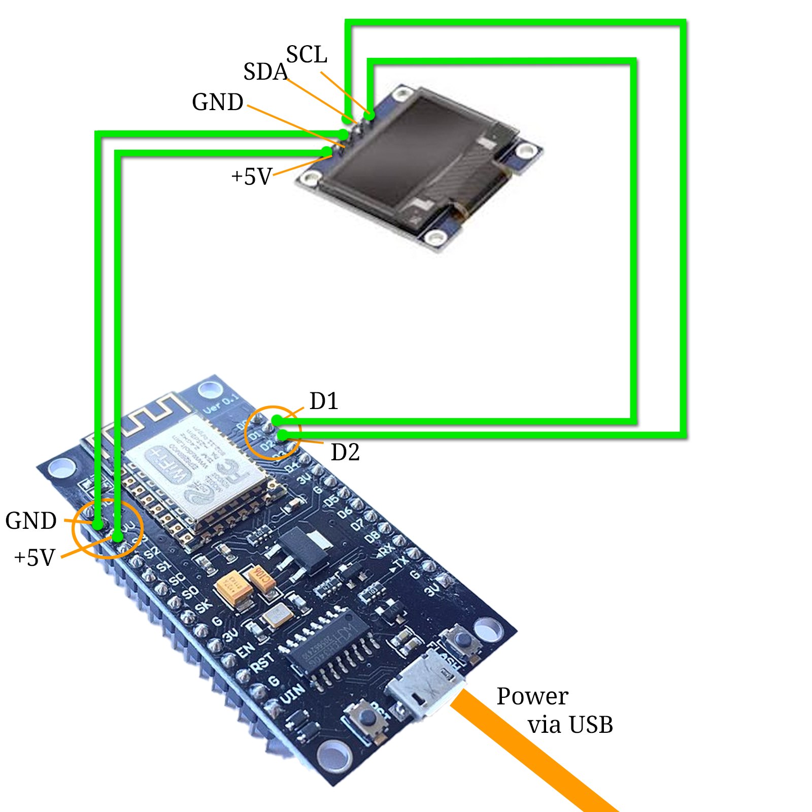

# Yet another wifi display

A friend (I'm looking at you, [derphilipp](https://github.com/derphilipp)!) "forced" me to ut this up here. So basically I've built this:



## Components


Here's the full code:
```C++
#include <Arduino.h>
#include <U8g2lib.h>
#ifdef U8X8_HAVE_HW_SPI
  #include <SPI.h>
#endif
#ifdef U8X8_HAVE_HW_I2C
  #include <Wire.h>
#endif
#ifdef __AVR__
  #include <avr/power.h>
#endif
#include <ESP8266WiFi.h>
// #include <WiFiClientSecureBearSSL.h>
#include <ESP8266HTTPClient.h>
#include <DNSServer.h>            
#include <ESP8266WebServer.h>     
#include <WiFiManager.h>
#include <ArduinoJson.h>

WiFiManager wifiManager;
#define SDApin 4;
#define SCLpin 5;
U8G2_SH1106_128X64_NONAME_F_HW_I2C u8g2(U8G2_R0, /* reset=*/ U8X8_PIN_NONE);
HTTPClient http;
String upArrow = "\x4c";
String downArrow = "\x49";
int screentime = 15 * 1000;

// main loop
void loop(void) {
  for (int i = 1; i < 5; i++) {
    u8g2.clearDisplay();
    u8g2.clearBuffer();
    if (i == 1) { page1(); }
    if (i == 2) { page2(); }
    if (i == 3) { page3(); }
    if (i == 4) { page4(); i = 0; }
    u8g2.sendBuffer();
    delay(screentime);
  } 
}

// function to make http request
        // {
            // https is possible but in my case not necessary:
              // std::unique_ptr<BearSSL::WiFiClientSecure>client(new BearSSL::WiFiClientSecure);
              // client->setInsecure();
              // HTTPClient https;
              // if (https.begin(*client, target_url + statusMode)) {  // ...
        // }
String fetchHttp(String url) {
  String content = "";
  if (http.begin(url)) {
    int httpCode = http.GET();
    if (httpCode > 0) {
      if (httpCode == HTTP_CODE_OK || httpCode == HTTP_CODE_MOVED_PERMANENTLY) {
        content = http.getString();
      } else { // http request not 200
        Serial.printf("[GET] Request... failed, error: %s\n", http.errorToString(httpCode).c_str());
        content = "{}";
      }
    } else { // http status code is 0
      Serial.println("[GET] Request... failed, HTTP returned zero");
      content = "{}";
    }
    http.end();
  } else { // http.begin() failed
    Serial.printf("[HTTPS.begin] Unable to connect\n");
    content = "{}";
  }
  return content;
}

// function to fetch json
DynamicJsonDocument fetchJson(String url, int docSize) {
  DynamicJsonDocument doc(docSize);
  deserializeJson(doc, fetchHttp(url));
  return doc;
}

// bitcoin screen
void page1() {
    // check how big your JSON doc ist here: https://arduinojson.org/v6/assistant/
    DynamicJsonDocument doc = fetchJson("http://192.168.X.Y/bitcoin.json", 500); // I have my own "API" because I use this for different things, but you could make this work with an public API like this as well: https://www.bitcoin.de/de/api/marketplace
    
    Serial.println("current BTC: " + doc["current"].as<String>());
    Serial.println("compared to average (1day): " + doc["compared"]["1day"].as<String>());
    Serial.println("compared to average (7day): " + doc["compared"]["7day"].as<String>());

    u8g2.setDrawColor(1);
    
    // write bitcoin chart value
    u8g2.setFont(u8g2_font_luRS18_tf); // u8g2_font_crox4hb_tr);
    u8g2.setCursor(0, 20);
    u8g2.print(doc["current"].as<String>());

    // Show the arrow for the 1-day trend
    u8g2.setFont(u8g2_font_open_iconic_all_4x_t);
    u8g2.setCursor(5, 62);
    if (doc["compared"]["1day"].as<String>() == "+") {
      u8g2.print(upArrow);
    } else {
      u8g2.print(downArrow);
    }

    // Show the arrow for the 7-day trend
    u8g2.setFont(u8g2_font_open_iconic_all_4x_t);
    u8g2.setCursor(91, 62);
    if (doc["compared"]["7day"].as<String>() == "+") {
      u8g2.print(upArrow);
    } else {
      u8g2.print(downArrow);
    }

    // draw a pseudo bitcoin logo
    u8g2.setCursor(48, 62);
    u8g2.print("\x5f"); 
    u8g2.drawLine(62,28,62,64);
    u8g2.drawLine(63,28,63,64);
    u8g2.drawLine(65,28,65,64);
    u8g2.drawLine(66,28,66,64);

    // draw a little 1 and 7 into the arrows to make it more readable
    u8g2.setDrawColor(0);
    u8g2.setFont(u8g2_font_5x8_tn);
    u8g2.setCursor(27, 58);
    u8g2.print("1");
    u8g2.setCursor(114, 58);
    u8g2.print("7");
    u8g2.setDrawColor(1);
}

// podcast chart screen
void page2() {
  DynamicJsonDocument doc = fetchJson("http://192.168.1.12/dash/podcast.json.php", 1536); // I have my own "API" because I use this for different things, but you could make this work with an public API like this as well: http://itunes.apple.com/de/rss/toppodcasts/genre=1487/limit=100/json
  
  int last_x = 4;
  int last_y = -1;
  for (int i = 0; i < 30; i++) {
    int x = last_x;
    int x_x = last_x + 4; 
    float place = doc["data_unsorted"][i].as<float>();
    int y = floor(place/200.0*64);
    if (last_y == -1) { last_y = y; }
    u8g2.drawLine(last_x,last_y,x,y);
    u8g2.drawLine(x,y,x_x,y);
    last_x = x_x;
    last_y = y;
  }

  u8g2.setFont(u8g2_font_luRS18_tf); // u8g2_font_crox4hb_tr);
  u8g2.setCursor(0, 62);
  u8g2.print("Ach: " + doc["data_unsorted"][29].as<String>());
}

// placeholders ... for now
void page3() {
  page1();
}

void page4() {
  page2();
}

void setup() {
  Serial.begin(9600); 
  delay(100);
  u8g2.begin();
  u8g2.setFont(u8g2_font_7x13B_mf);
  u8g2.setCursor(0, 20);
  u8g2.print("Setting up ...");
  delay(200);
  u8g2.setCursor(0, 40);
  u8g2.print("Chip: " + String(ESP.getChipId()));
  u8g2.sendBuffer();
  
  #if defined(__AVR_ATtiny85__) && (F_CPU == 16000000)  // Not really sure if this is needed ...
    clock_prescale_set(clock_div_1);
  #endif
  
  //WiFi.disconnect();   // Uncomment to delete old/saved WiFi credentials 
  u8g2.setCursor(0, 60);
  u8g2.print("Wifi connect");
  delay(500);
  u8g2.sendBuffer();
  Serial.print("\nTrying to connect to WiFi ...\n");
  delay(50);
  wifiManager.autoConnect(("setup-display-" + String(ESP.getChipId())).c_str()); // Tries to connect to a known wifi – 
                                                                                  // if this failed, it opens up an access point under 192.168.4.1
  u8g2.setCursor(0, 60);
  u8g2.print("Wifi successful");
  u8g2.sendBuffer();
  
  http.useHTTP10(true);
}
```

Have fun rebuilding or improving this – and don't forget to [let me know about it](https://twitter.com/MirUnauffaellig)!

## Licensing info

This project with all its contents is under CC BY NC 4.0 license. Learn more about what you may and what you may not do here: ([German](https://creativecommons.org/licenses/by-nc/4.0/deed.de) | [English](https://creativecommons.org/licenses/by-nc/4.0/deed.en))
